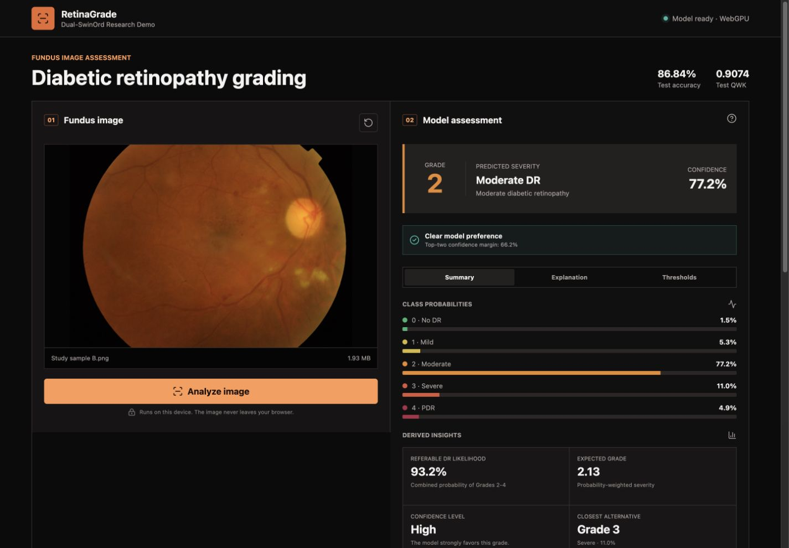
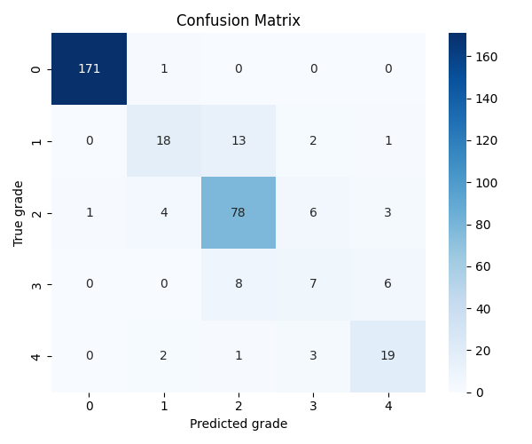
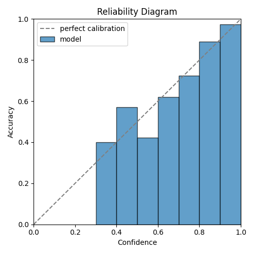
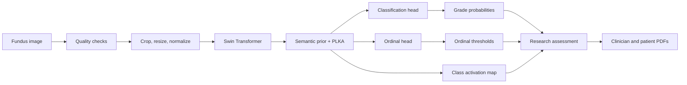

<h1 align="center">RetinaGrade</h1>

<p align="center">
  An on-device research application for five-grade diabetic retinopathy assessment using Dual-SwinOrd.
</p>

<p align="center">
  <a href="https://mohamed00212-retinagrade.static.hf.space/"></a>
  <a href="https://github.com/Mohamedtarek00212/RetinaGrade/actions/workflows/tests.yml"></a>
  
  
  <a href="LICENSE"></a>
</p>

<p align="center">
  <a href="https://mohamed00212-retinagrade.static.hf.space/">
    
  </a>
</p>

> [!IMPORTANT]
> RetinaGrade is a research and education project, not a medical device. Its
> output must not be used for diagnosis, triage, or treatment decisions.

## Overview

RetinaGrade reproduces the Dual-SwinOrd approach for ordinal diabetic
retinopathy grading on the APTOS 2019 dataset. The repository covers the full
research path: data validation, preprocessing, model architecture, training,
locked-test evaluation, ONNX export, browser inference, visual explanation,
professional PDF reporting, and automated deployment.

The public application performs inference inside the visitor's browser. A
fundus image is preprocessed locally, passed to a quantized ONNX model, and
converted into a five-class probability distribution, ordinal thresholds, and
a class activation map. The uploaded image and report details never leave the
device.

**[Try the public application](https://mohamed00212-retinagrade.static.hf.space/)**

## Highlights

- Five-grade classification: No DR, Mild, Moderate, Severe, and PDR.
- Dual-head learning with categorical and ordinal objectives.
- Swin Transformer backbone with semantic prior injection and PLKA attention.
- Image-quality checks before inference.
- Class probabilities, expected grade, top-two margin, and referable-DR score.
- Class activation map with explicit explanation limitations.
- WebGPU acceleration with automatic WebAssembly CPU fallback.
- Approximately 53 MB quantized browser model cached in IndexedDB.
- Separate clinician review and patient information PDF reports.
- GitHub Actions testing, build verification, and automatic Hugging Face deploy.

## Results

The checkpoint was selected at epoch 24 using validation QWK. The 342-image
test split remained locked until final evaluation and did not influence model
selection.

| Metric | Validation | Locked test |
|---|---:|---:|
| Accuracy | 85.17% | **86.84%** |
| Quadratic Weighted Kappa | **0.9177** | **0.9074** |
| Macro F1 | 69.59% | 67.83% |
| Mean Absolute Error | 0.1860 | 0.1784 |
| Within-one-grade accuracy | 97.09% | 96.20% |
| Referable DR AUC | - | 98.18% |
| Referable DR false-negative rate | - | 3.42% |

<p align="center">
  
  
</p>

Class imbalance remains visible in the Severe DR class. Macro F1 and per-class
results should therefore be considered alongside overall accuracy and QWK.

## System Flow



The web client begins downloading and preparing the model as soon as a valid
image is selected. Image preprocessing and any remaining runtime preparation
then proceed concurrently. IndexedDB persistence runs in the background so the
first inference does not wait for the cache write.

## Browser Application

The React and TypeScript interface provides three result views:

| View | Information |
|---|---|
| Summary | Grade, confidence, full distribution, referable probability, expected grade, and closest alternative |
| Explanation | Original image, contribution overlay, interpretation boundaries, and research guidance |
| Thresholds | Four ordinal probabilities used to reason across the ordered grade scale |

The PDF workspace creates two documents entirely in the browser:

- **Clinician review report:** model outputs, quality findings, activation map,
  notes, and review sign-off.
- **Patient information summary:** plain-language wording and only the next
  steps approved by the reviewing clinician.

The patient document requires clinician confirmation. Neither report turns the
research prediction into an automated care decision.

## Repository Layout

```text
RetinaGrade/
├── configs/                 # Data, model, and training configuration
├── data/                    # Local raw/processed data and split manifests
├── deployment/              # Optional FastAPI inference service
├── docs/                    # Design, deployment, and milestone notes
├── frontend/                # React, TypeScript, ONNX Runtime Web application
├── presentation_assets/     # Metrics, charts, EDA, and reporting sources
├── scripts/                 # Prepare, train, evaluate, predict, and export
├── src/
│   ├── data/                # Dataset, preprocessing, augmentation, and audit
│   ├── evaluation/          # Metrics, calibration, and confusion matrix
│   ├── losses/              # Classification, ordinal, CARM, and total loss
│   ├── models/              # Dual-SwinOrd architecture and components
│   ├── training/            # Trainer, callbacks, checkpoints, and logging
│   └── visualization/       # Grad-CAM and SHAP utilities
├── tests/                   # Unit and integration tests
└── .github/workflows/       # CI and automatic public deployment
```

## Quick Start

### Public demo

Open the **[direct static application](https://mohamed00212-retinagrade.static.hf.space/)**.
No installation, account, server, or paid GPU is required.

### Frontend development

```bash
git clone https://github.com/Mohamedtarek00212/RetinaGrade.git
cd RetinaGrade/frontend
npm ci
npm run dev
```

The ONNX model is stored with Git LFS. Ensure Git LFS is installed before
cloning, or run `git lfs pull` before building the frontend.

### Python environment

Python 3.10-3.12 is supported.

```bash
python -m venv .venv
source .venv/bin/activate
python -m pip install --upgrade pip
pip install -e ".[dev,deployment]"
pytest
```

For ONNX export, install the additional dependencies:

```bash
pip install -e ".[onnx]"
python scripts/export_onnx.py
```

### Single-image prediction

```bash
python scripts/export_inference_checkpoint.py
python scripts/predict.py path/to/fundus.png \
  --checkpoint outputs/checkpoints/deployment/model_inference.pt
```

The command returns the grade, class label, confidence, class probabilities,
and ordinal-threshold probabilities as JSON.

## Data and Checkpoints

Place APTOS 2019 images under `data/raw/train`, `data/raw/val`, and
`data/raw/test`. Split CSV files belong in `data/splits` as `train.csv`,
`valid.csv`, and `test.csv`. Raw images and split files are intentionally not
committed.

The full training checkpoint is tracked with Git LFS at
`outputs/checkpoints/training/best.pt` and is also available from the
[v0.1.0 release](https://github.com/Mohamedtarek00212/RetinaGrade/releases/download/v0.1.0/best.pt).

```text
SHA256: 5B979123FDA8179F6DFD59AD45EA0E7CE3D8B6B6DF47CFBA39776528779DF389
```

The browser artifact uses quantized weights and is stored at
`frontend/public/models/retinagrade.int8.onnx`. A 15-image, grade-balanced
compatibility check retained all top-1 predictions with a maximum class
probability change of 0.0169. This compatibility check does not replace the
full validation or locked-test evaluation.

## Deployment

Every push to `main` follows the same release gate:

1. Run the Python test suite.
2. Install, lint, and build the frontend with the real Git LFS model.
3. Validate the generated static bundle.
4. Upload the tested `frontend/dist` artifact to Hugging Face Spaces.
5. Confirm that the direct public URL serves the new hashed JavaScript asset.

The browser application is the recommended free deployment. Optional CPU and
NVIDIA GPU containers remain available for centralized FastAPI inference. See
[`docs/deployment.md`](docs/deployment.md) for both paths.

## Reproducibility and Limitations

- Algorithmic decisions follow the described Dual-SwinOrd reproduction; code
  organization and deployment changes are treated as engineering work.
- The locked test set was evaluated once after validation-based checkpoint
  selection.
- The activation map describes spatial contribution to the selected class. It
  does not identify lesions or establish a diagnosis.
- Confidence describes model preference, not guaranteed correctness.
- Browser WebGPU support varies; WebAssembly CPU execution is the supported
  compatibility path.
- Clinical validation, prospective testing, regulatory review, and deployment
  monitoring are outside the scope of this research project.

## License

Released under the [MIT License](LICENSE).
